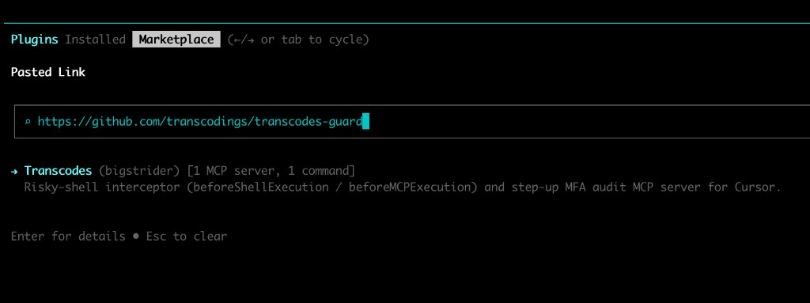

# transcodes-guard

**English** | [한국어](./README.ko.md)

## Intro

`transcodes-guard` is a PreToolUse-hook + MCP-server gate that intercepts risky shell commands (and protected MCP tool calls) from AI coding agents _right before execution_ and forces a Transcodes Step-up MFA (WebAuthn) challenge against the Transcodes backend. Only verified commands run.

It is one git repo with one shared core (npm workspaces) and four host plugins — Claude Code, Codex, Cursor, and Antigravity — each installed via its native mechanism. The plugins are not distributed via npm; only the `transcodes` CLI is. The repo, product, and plugins are all named `transcodes-guard`.

Node.js >= 20 is required for all hosts.

## Installation

### Claude Code

Claude Code is the primary host. The marketplace **is** this repo. Run two lines in a Claude Code session:

```
/plugin marketplace add transcodings/transcodes-guard
/plugin install transcodes-guard@bigstrider
```

`dist/` is committed, so it installs immediately from clone — no build step needed. Disable it with the native `/plugin disable transcodes-guard`.

For team auto-registration, add this to your project's `.claude/settings.json`:

```json
{
  "extraKnownMarketplaces": [
    { "source": "github", "repo": "transcodings/transcodes-guard" }
  ],
  "enabledPlugins": ["transcodes-guard@bigstrider"]
}
```

### Codex

Prerequisites: a Codex CLI build with plugin + hooks support (`codex plugin --help` should work), Node >= 20.

**Step 1 — install via the Codex marketplace.** The repo ships `.agents/plugins/marketplace.json`, a Codex catalog pointing at `./plugins/codex`. `codex plugin marketplace add` accepts a GitHub repo directly (Codex clones it for you), and `dist/` is committed, so no manual clone or build is needed:

```bash
codex plugin marketplace add transcodings/transcodes-guard   # registers the "bigstrider" marketplace
codex plugin add transcodes-guard@bigstrider                 # installs the plugin
# or in Codex: /plugins → install "transcodes-guard" from the bigstrider marketplace
```

Codex resolves `.agents/plugins/marketplace.json` ahead of the legacy `.claude-plugin/marketplace.json`, so it always installs the Codex plugin (`./plugins/codex`), not the Claude one. For a reproducible install, choose the desired release tag from GitHub and pass it with `--ref`; the unpinned command above follows the current marketplace source.

**Step 2 — first run.** Codex prompts a one-time hook trust review (`/hooks` to inspect). Approve it once. Do **not** use `--dangerously-bypass-hook-trust`.

**Step 3 — save your token** (the member MCP JWT) so step-up can start. Recommended: `npm install -g @bigstrider/transcodes-cli` then run `transcodes` to open the local dashboard (URL printed in the terminal; default port 3847) and paste your token (persisted to `~/.transcodes/config.json` for every session). Non-interactive: `transcodes set <token> -l <label>`. Without a token, the hook still DENIES danger commands but cannot open a step-up session.

### Antigravity (Beta Version)

> Antigravity plugin support is in **beta** — install flow and APIs may change.

Prerequisites: **Node >= 20** and **Google Antigravity 2.0** (desktop app or the `agy` CLI). Install the CLI if you do not have it yet:

```bash
curl -fsSL https://antigravity.google/cli/install.sh | bash
```

Then run **one line** — no manual `cd`, no `npm install`, no build step (`dist/` is committed):

```bash
git clone https://github.com/transcodings/transcodes-guard.git /tmp/tg-install && node /tmp/tg-install/plugins/antigravity/install.mjs && rm -rf /tmp/tg-install
```

The bundled installer copies the Antigravity plugin into `~/.gemini/config/plugins/transcodes-guard` (shared by the desktop app and `agy` CLI since CLI v1.0) and rewrites the `__PLUGIN_DIR__` placeholder in `hooks.json` / `mcp_config.json` to that directory's absolute path. Antigravity exposes no plugin-root path variable, so absolute paths must be injected at install time.

Re-run the same one-liner to update — it overwrites the existing install in place.

Also save your token — recommended: `npm install -g @bigstrider/transcodes-cli` then `transcodes` (dashboard). Non-interactive: `transcodes set <token> -l <label>`.

> **Do not use** `agy plugin install https://github.com/transcodings/transcodes-guard`. That command treats this repo as a bulk multi-plugin catalog and installs **both** the Antigravity and Claude Code adapters into Antigravity (wire-format mismatch), and it skips the `__PLUGIN_DIR__` path rewrite — hooks and MCP then fail at runtime. Use the one-liner above instead.
>
> **Contributors / workspace-only install:** clone the repo and run `node plugins/antigravity/install.mjs --local` (copies into `<cwd>/.agents/plugins/transcodes-guard`).

> Note: Antigravity's PreToolUse matcher is `run_command|mcp_.*|call_mcp_tool`, gating shell execution **and** MCP tool calls — including lazy-loaded calls that Antigravity routes through a generic `call_mcp_tool` wrapper (the adapter unwraps the real tool name from `args.ToolName`). File-edit tools (`write_to_file`, …) are not gated.

### Cursor (Beta Version)

> Cursor plugin support is in **beta** — install flow and APIs may change.

Prerequisites: **Node >= 20**, Cursor **desktop** with Hooks enabled (Settings → Hooks). Cloud agents are not wired as of 2026-05.

**Step 1 — install the Cursor Agent CLI** (`cursor-agent`):

```bash
curl https://cursor.com/install -fsS | bash
```

**Step 2 — install from Marketplace.** Open **Plugins → Marketplace** in the `cursor-agent` CLI (or Cursor → Customize → Plugins → Marketplace) and paste:

```
https://github.com/transcodings/transcodes-guard
```

Select **Transcodes (bigstrider)** → **Install**:



The repo ships `.cursor-plugin/marketplace.json` pointing at `plugins/cursor`; `dist/` is committed — no clone, no build. Hooks and the MCP server auto-wire via `${CURSOR_PLUGIN_ROOT}`.

**Step 3 — first run.** Approve the one-time hook trust review (command palette → **Cursor: Review Hooks**).

**Step 4 — save your token.** Recommended: `npm install -g @bigstrider/transcodes-cli` then `transcodes` (dashboard). Non-interactive: `transcodes set <token> -l <label>`.

To **update**, reinstall from Marketplace (or update in Customize → Plugins) then **Developer: Reload Window**.

## CLI installation

`@bigstrider/transcodes-cli` (bin: `transcodes`) is the human control plane: it stores the member token that the hooks and MCP server read, and it owns `~/.transcodes/`. Unlike the plugins, it **is** published to npm. It is not a plugin — it is the token + dashboard tool.

```bash
npx @bigstrider/transcodes-cli            # run the dashboard without installing
npm install -g @bigstrider/transcodes-cli # or install globally → `transcodes` command
```

Commands:

- `transcodes` (no args) — GUI dashboard
- `transcodes set <token> -l <label>` — store a token
- `transcodes tokens` — list stored tokens
- `transcodes status` — active token source + expiry
- `transcodes console` — open auth settings (passkeys, TOTP) in your browser
- `transcodes reset` — delete all saved tokens
- `transcodes policy refresh` — force-refresh the org policy bundle cache
- `transcodes version` — print the installed CLI version
- `transcodes help` — full command list and usage

The member token is stored at `~/.transcodes/config.json`; the hooks and the MCP server read it via the shared resolver. There is **no** gate on/off toggle in the CLI — to turn protection off, disable or uninstall the plugin via the host's native mechanism.

## Key features

### Step-up auth

The core gate. The flow:

1. An agent tries a Bash command (or a protected MCP tool call).
2. The PreToolUse hook detects a danger pattern (regex + an `rm -rf` git-tracked semantic check) or a protected tool → it DENIES and surfaces a WebAuthn step-up URL.
3. The user completes WebAuthn in the browser → the agent confirms via the MCP tool `poll_stepup_session_wait` (a server-side long-poll).
4. With a verified record, **re-running the same command** passes the hook. It is single-shot — the next danger command challenges again.

**Asymmetric fail policy** (the security core): _before_ a danger match (stdin parse, classify, pattern load) the gate is FAIL-OPEN — a crash never blocks a safe command. _After_ a danger match it is FAIL-SAFE — a crash never silently allows a risky command. Blocking is fail-safe.

Diagnostics MCP tools:

- `inspect_stepup_state` — read-only snapshot with `age_ms` / `expired` / `ttl_ms`.
- `simulate_command`
- `simulate_hook_invocation` — spawns the **real** hook binary (not a dry run; it can consume a verified record or open a browser).

A token (the member MCP JWT) is required for step-up to actually start. Recommended: install the CLI (`npm install -g @bigstrider/transcodes-cli`) and run `transcodes` to enter it in the dashboard. Non-interactive: `transcodes set <token> -l <label>`.

### tool_rules (protected MCP tools)

An exact/glob `toolName` match against a tool-rule registry triggers a step-up on sensitive MCP tool calls (e.g. member retirement, role/permission changes, passcode issuance). Two tiers:

- **SYSTEM rules** — Transcodes-specific protected-tool → `stepupAction` / `stepupResource` policy mappings, shipped as policy data (the tool list is policy surface, kept private). System rule ids are reserved and cannot be overridden.
- **USER rules** — added at runtime via the MCP tool `add_tool_rule` (writes through the backend API; `type:'mcp'`). They default to `consume_in_hook=true` (single-shot, consumed in the hook).

No rebuild is needed to add a user rule.

### user_patterns (custom Bash patterns)

Bash danger detection is a regex match against the full command string. Two tiers:

- **SYSTEM patterns** — generic risky shell: `rm -rf` against an absolute path / HOME, bare-glob `rm -rf`, `dd of=/dev/...`, `mkfs`, `curl ... | bash`, fork bomb, recursive `chmod` on HOME, protected-branch force-push. Embedded at build time. Plus a `rm -rf <relative path>` **semantic** check: it resolves the target against cwd and blocks if it contains git-tracked files (catching what regex misses).
- **USER patterns** — added at runtime via the MCP tool `add_user_pattern` (writes through the backend API; `type:'bash'`, with the regex in the rule's `name`). There is **no** local `user-patterns.json` authoring file — authoring is backend-API only.

Matching runs each compiled regex against the full command string (comments, quoted args, and heredocs all match; there is no token extraction) — first match wins, system before user.

Known limits (briefly): shell quoting is not understood (`echo "rm -rf /"` can match → a possible false positive); regex bypass is partially possible (this is the first line of defense); the semantic check is skipped in non-git directories.

## License

Functional Source License, Version 1.1, ALv2 Future License (`FSL-1.1-ALv2`) — converts to Apache 2.0 after 2 years. See [./LICENSE.md](./LICENSE.md).
